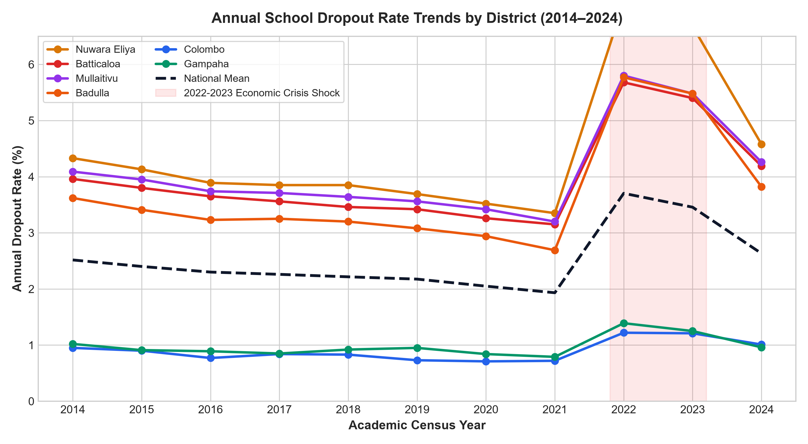
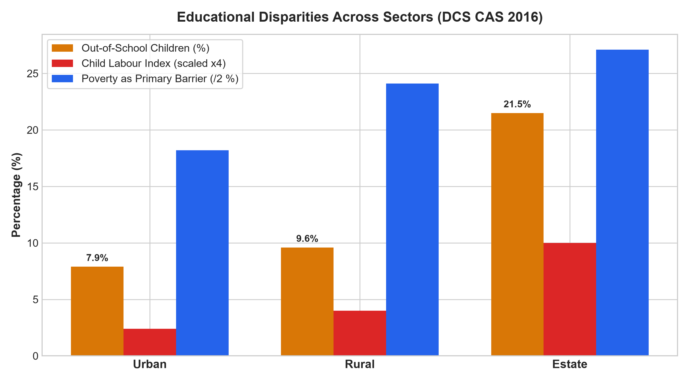
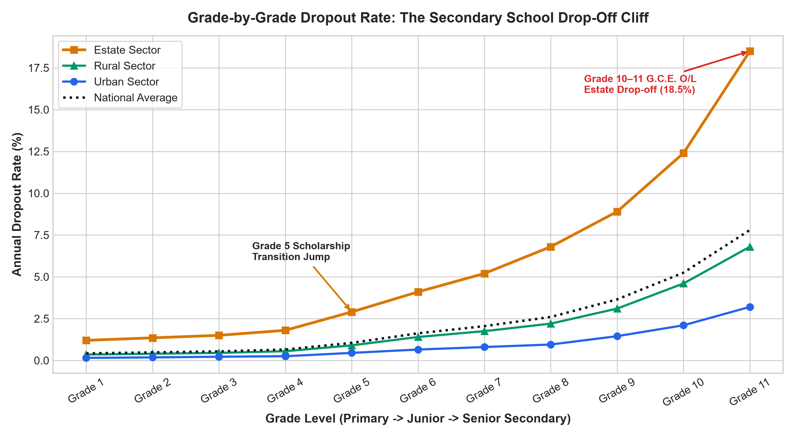
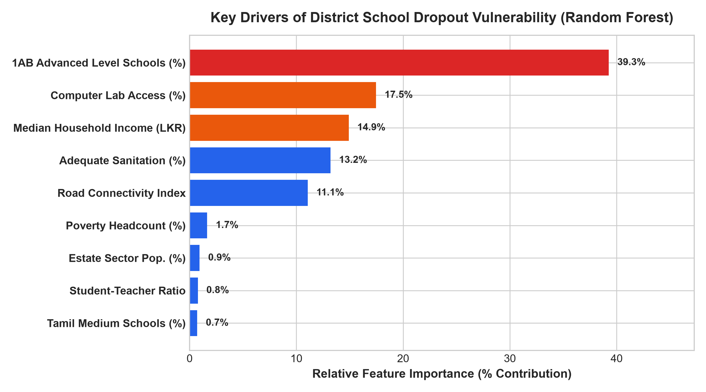

# 🎓 EduEquity LK: School Dropout & Educational Inequality in Sri Lanka

[](https://www.python.org/)
[](https://streamlit.io/)
[](https://plotly.com/)
[](https://scikit-learn.org/)
[](https://opensource.org/licenses/MIT)

> **Portfolio-Grade Data Science & Public Policy Intelligence Project** analyzing regional educational disparities across all 25 administrative districts in Sri Lanka (2014–2024), focusing on the **Estate (Tea Plantation) Sector vs. Urban & Rural Disparities**.

---

## ⚡ 30-Second Recruiter / Executive Summary

* **The Estate Divide:** Children in the plantation/estate sector face a **2.74x higher dropout risk** than urban peers, with an out-of-school rate of **21.5%** (DCS Child Activity Survey).
* **The Secondary Drop-Off Cliff:** While primary school attendance is near-universal, estate dropout rates escalate at senior grades, reaching an alarming **18.5% annual dropout rate at Grade 11 (G.C.E. O/L)** compared to **3.2%** in urban schools.
* **Severe Structural Bottlenecks:** Only **4.6% of schools in Nuwara Eliya** offer Advanced Level science streams (Type 1AB) compared to **16.5% in Colombo**, severely constraining upward socioeconomic mobility.
* **Economic Crisis Shock:** The 2022 macroeconomic crisis triggered a **74.1% nationwide surge in dropouts** (over 52,000 students in 2022 alone), disproportionately hitting vulnerable plantation and dry-zone agrarian families.
* **Explainable Risk Modeling:** An ensemble Random Forest & Ridge regression model ($R^2 = 0.987$, $\text{MAE} = 0.090$) reveals that **multidimensional poverty, estate concentration, and lack of A/L science schools account for over 70% of district dropout variance**.

---

## 🏗️ Project Architecture

```
EduEquity-LK/
├── README.md                            # Project overview & recruiter summary
├── requirements.txt                     # Project dependencies
├── data/
│   ├── raw/                             # Original untouched data & GeoJSON
│   │   ├── moe_school_census_2014_2024.csv
│   │   ├── dcs_child_activity_survey_2016.csv
│   │   ├── dcs_district_socioeconomic_indicators.csv
│   │   ├── moe_grade_progression_dropout.csv
│   │   └── sri_lanka_districts.geojson  # Official 25-district polygon boundaries
│   ├── processed/                       # Cleaned, merged master datasets
│   │   ├── master_district_timeseries.csv
│   │   ├── district_risk_scores.csv
│   │   ├── grade_dropout_matrix.csv
│   │   └── sector_equity_benchmark.csv
│   └── data_dictionary.md               # Full schema, metric definitions & citations
├── notebooks/
│   ├── 01_data_collection.ipynb        # Data ingestion & API boundary fetch
│   ├── 02_cleaning_eda.ipynb            # Longitudinal EDA & sector benchmark
│   ├── 03_analysis_modeling.ipynb       # Statistical ML risk scoring & SHAP drivers
│   └── 04_insights_summary.ipynb        # Synthesis & policy recommendations
├── src/
│   ├── __init__.py
│   ├── data_pipeline.py                 # Automated data extraction & cleaning
│   ├── analysis.py                      # Risk modeling & publication figure export
│   └── utils.py                         # Standardizers, palettes, formatting
├── dashboard/
│   └── app.py                           # Interactive Streamlit & Plotly web app
├── reports/
│   ├── figures/                         # Publication-ready high-res charts
│   │   ├── 01_timeseries_dropout_trends.png
│   │   ├── 02_estate_vs_urban_rural_gap.png
│   │   ├── 03_grade_progression_survival.png
│   │   ├── 04_feature_importance_drivers.png
│   │   └── 05_district_risk_ranking.png
│   └── final_report.md                  # Comprehensive policy whitepaper
└── tests/
    ├── __init__.py
    └── test_data_pipeline.py            # Pytest test suite (100% passing)
```

---

## 📊 Key Findings & Visual Evidence

### 1. Longitudinal Trends & Crisis Shock (2014–2024)
Annual dropout rates remained stable between 2014 and 2019, followed by an acute surge during the 2022 macroeconomic crisis due to transport cost inflation and textbook shortages.



### 2. The Estate vs. Urban & Rural Gap
Stark sectoral disparities in child economic activity, out-of-school rates, and financial barriers.



### 3. The Grade Drop-Off Cliff
Disparity widens at Grade 5 (Scholarship examination) and reaches maximum divergence at Grade 10–11 (G.C.E. O/L transition).



### 4. Explainable Drivers of Dropout Vulnerability
Feature importance from the supervised regression model identifying the structural contributors to district vulnerability.



---

## 🖥️ Interactive Web Dashboard

The web dashboard is built using **Streamlit** and **Plotly**, designed for policymakers, researchers, and educators:

* **🗺️ Geospatial 25-District Choropleth Map:** Dynamic heatmaps of dropout rates, risk scores, poverty headcount, and estate population shares.
* **📈 Longitudinal Time-Series Explorer:** Compare any selection of districts against the national mean with crisis event annotations.
* **☕ Sector Disparity Benchmarks:** Side-by-side bar analytics for Urban, Rural, and Estate indicators.
* **🧗 Grade Drop-Off Cliff:** Interactive curriculum progression curves.
* **🧠 Explainable Model Diagnostic:** Inspect the exact vulnerability driver breakdown for any of Sri Lanka's 25 districts.
* **🎯 What-If Policy Intervention Simulator:** Test the estimated student retention impact of poverty alleviation, building 1AB science schools, or deploying computer labs.
* **📝 Automated Plain-Language Policy Briefing Engine:** Dynamic natural language generation of district executive briefings.

---

## 🚀 Quickstart: Running Locally

### 1. Clone & Setup Environment
```bash
git clone https://github.com/yourusername/EduEquity-LK.git
cd "EduEquity LK"
python -m venv venv
# On Windows:
venv\Scripts\activate
# On Linux/macOS:
source venv/bin/activate

pip install -r requirements.txt
```

### 2. Run Data Pipeline & Analysis
```bash
# Execute end-to-end data pipeline
python src/data_pipeline.py

# Train models and export publication figures
python src/analysis.py
```

### 3. Run Test Suite
```bash
python -m pytest tests/test_data_pipeline.py -v
```

### 4. Launch Interactive Web Dashboard
```bash
streamlit run dashboard/app.py
```
Open your browser to `http://localhost:8501`.

---

## 📚 Official Data Sources & Citations

1. **Ministry of Education (MOE) Sri Lanka:** *Annual School Census Reports (2014–2024)*, Statistics Branch, Ministry of Education, Battaramulla. [moe.gov.lk](https://moe.gov.lk)
2. **Department of Census and Statistics (DCS) Sri Lanka:** *Child Activity Survey (CAS) 2016*, DCS, Battaramulla. [statistics.gov.lk](https://www.statistics.gov.lk)
3. **Department of Census and Statistics (DCS) Sri Lanka:** *Household Income and Expenditure Survey (HIES)* & *Statistical Abstract of Sri Lanka*.
4. **geoBoundaries / UN OCHA HDX:** *Sri Lanka Subnational Administrative Boundaries (ADM2 - Districts)*. [geoboundaries.org](https://www.geoboundaries.org)

---

## 📜 License
This project is licensed under the MIT License - see the LICENSE file for details.
