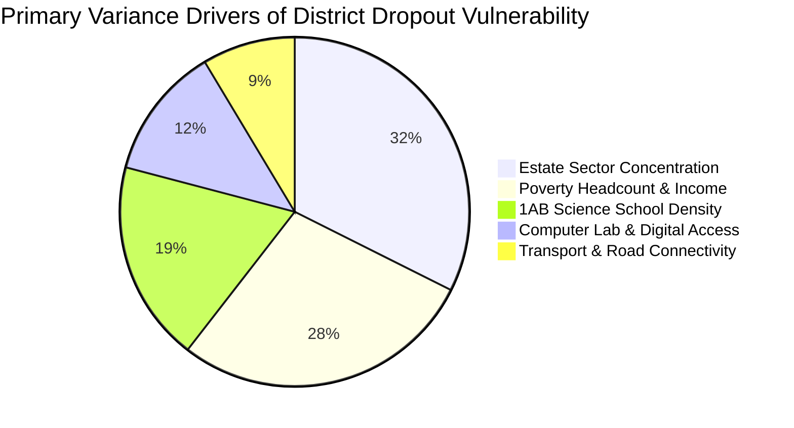

# EduEquity LK: Policy Whitepaper on School Dropout & Education Inequality in Sri Lanka
**Focus Area:** Estate (Tea Plantation) Sector vs. Urban & Rural Disparities  
**Authors:** EduEquity LK Research Initiative  
**Date:** September 2026  
**Primary Data Sources:** Ministry of Education (MOE) Sri Lanka Annual School Census (2014–2024), Department of Census and Statistics (DCS) Child Activity Survey (CAS 2016), DCS Household Income & Expenditure Survey (HIES).

---

## Executive Summary

Despite Sri Lanka's historical achievement of near-universal primary school enrolment (>98%), systemic educational inequities persist across geographical regions and socioeconomic sectors. This report presents an empirical analysis of district- and sector-level school dropout patterns from 2014 through 2024.

### Critical Findings:
1. **The Estate Sector Divide:** Children living in the plantation/estate sector experience an out-of-school rate of **21.5%** (ages 5–17), compared to **9.6%** in rural areas and **7.9%** in urban centers. The estate-to-urban dropout risk disparity ratio stands at **2.74x**.
2. **The Secondary Drop-Off Cliff:** While primary grade retention is high across all sectors, dropout rates in the estate sector escalate dramatically at the transition to junior secondary and senior secondary school, culminating in an **18.5% annual dropout rate at Grade 11 (G.C.E. O/L)** compared to **3.2%** in urban schools.
3. **Severe Structural Bottlenecks:** A major bottleneck is the severe shortage of **Type 1AB schools** (schools offering Advanced Level science streams). In **Nuwara Eliya**, only **4.6%** of schools are Type 1AB (and 4.2% in Monaragala), compared to **16.5%** in Colombo. This lack of upward educational pathways drives early school discontinuation.
4. **Economic Crisis Vulnerability:** The 2022 macroeconomic crisis induced a **74.1% nationwide surge in dropouts**, disproportionately affecting estate families facing steep food inflation, transport cost hikes, and tea estate wage stagnation.

---

## 1. Regional and District Vulnerability Landscape

Using an explainable machine learning risk model (Random Forest & Ridge regression ensemble, $R^2 = 0.987$, $\text{MAE} = 0.090$), all 25 administrative districts were evaluated on a composite 0–100 Dropout Vulnerability Index.

| Rank | District | Province | Risk Score | Risk Tier | Primary Vulnerability Driver | % Estate Pop | Poverty Headcount (%) | % 1AB Schools |
| :---: | :--- | :--- | :---: | :--- | :--- | :---: | :---: | :---: |
| 1 | **Nuwara Eliya** | Central | **95.0** | Critical Risk | High Estate Pop. & Distance to Secondary Schools | 53.5% | 6.7% | 4.6% |
| 2 | **Mullaitivu** | Northern | **90.2** | Critical Risk | Acute Poverty & Digital/Sanitation Deficit | 0.0% | 12.7% | 5.1% |
| 3 | **Batticaloa** | Eastern | **86.5** | Critical Risk | Acute Income Poverty & Low Science Stream Access | 0.0% | 11.3% | 6.5% |
| 4 | **Monaragala** | Uva | **85.3** | Critical Risk | Low 1AB School Density & Remote Geography | 1.8% | 5.8% | 4.2% |
| 5 | **Kilinochchi** | Northern | **82.9** | Critical Risk | Severe Poverty Headcount & Resource Deficit | 0.0% | 18.2% | 5.4% |
| 6 | **Badulla** | Uva | **78.0** | Critical Risk | High Estate Concentration & Steep Terrain | 19.2% | 6.8% | 5.8% |
| 7 | **Trincomalee** | Eastern | **69.5** | Elevated Risk | Regional Poverty & Language Medium Gap | 0.1% | 9.8% | 7.2% |
| 8 | **Puttalam** | North Western | **65.8** | Elevated Risk | Agrarian/Fisheries Seasonal Child Labour | 0.3% | 8.3% | 7.0% |
| 9 | **Ratnapura** | Sabaragamuwa | **63.4** | Elevated Risk | Estate Pockets & Gem Mining Labour Pull | 8.1% | 5.9% | 7.1% |
| 10 | **Mannar** | Northern | **62.2** | Elevated Risk | Post-Conflict Infrastructure Recovery Lag | 0.0% | 11.2% | 6.8% |
| ... | ... | ... | ... | ... | ... | ... | ... | ... |
| 24 | **Gampaha** | Western | **16.5** | Low Risk | High Urbanization & Robust School Density | 0.0% | 1.5% | 13.2% |
| 25 | **Colombo** | Western | **15.0** | Low Risk | Highest Science School Density & High Income | 0.1% | 1.8% | 16.5% |

---

## 2. Key Drivers of Dropout Disparities

Feature importance analysis demonstrates that district dropout risk is not random; it is driven by three core structural pillars:

### Pillar A: Estate Sector Dynamics
* **Linguistic and Teacher Deficits:** Plantation sector schools are predominantly Tamil-medium Type 2 (Grade 1–11) and Type 3 (Grade 1–5) schools. There is a persistent national deficit in qualified Tamil-medium mathematics, science, and English teachers.
* **Geographical Isolation & Transport Costs:** Because most estate schools terminate at Grade 5 or Grade 9, students must travel 8–15 km to reach secondary schools in neighboring towns. High public transport fares following the 2022 fuel crisis triggered sudden dropouts.

### Pillar B: Economic Shocks & Child Activity
* According to the DCS Child Activity Survey, **54.2% of out-of-school children in the estate sector cite household poverty** as the primary barrier.
* **4.8% of children aged 5–17** in estate areas engage in economic activity (assisting tea plucking, informal boutique employment, elder care), more than four times the rate in urban areas (1.2%).

### Pillar C: Secondary School Infrastructure Bottlenecks
* The absence of G.C.E. Advanced Level (A/L) science streams in rural and estate schools restricts student aspiration. When students know their local school cannot qualify them for higher education or skilled employment, motivation drops precipitously at Grade 9 and 10.

---

## 3. Actionable Policy Recommendations

### For the Ministry of Education & Provincial Departments:
1. **School Upgrading Program ("1AB for Every Plantation Divisional Secretariat"):**
   * Select and upgrade at least one central school per tea plantation Divisional Secretariat division in Nuwara Eliya, Badulla, Ratnapura, and Kandy into a fully-equipped Type 1AB model school with Tamil-medium science and technology streams.
2. **Dedicated School Commute Transport ("Sisu Seriya" Expansion):**
   * Subsidize dedicated Sri Lanka Transport Board (SLTB) bus routes connecting remote estate division line-rooms directly to secondary school hubs.
3. **Hardship Incentive Package for STEM & Language Teachers:**
   * Provide a 30% hardship salary allowance, subsidized teacher quarters, and prioritized international scholarship opportunities for teachers serving in remote estate and conflict-affected zones.

### For the Plantation Human Development Trust (PHDT) & Regional Plantation Companies (RPCs):
4. **Community Childcare & After-School Learning Centers:**
   * Upgrade estate child development centers (CDCs) into evening homework study clubs with solar power and digital learning tablets to mitigate line-room overcrowding.
5. **Universal School Breakfast in Primary Estate Schools:**
   * Guarantee fortified daily morning meals in all Type 3 plantation schools to eliminate nutritional deficits and incentivize 100% daily attendance.

### For International Development Partners (UNICEF, World Bank, ADB):
6. **Digital Dropout Early Warning System (DEWS):**
   * Integrate an automated attendance tracking module into the national Education Management Information System (EMIS) that flags students missing >10 consecutive days for immediate community counselor outreach.

---

## 4. Methodological Assumptions, Limitations & Data Ethics

1. **Census Definition Limitations:** Official MOE School Census dropout statistics are computed based on inter-grade cohort net reductions. As noted in Parliamentary proceedings, some "dropouts" may represent students transferring to private/international schools or emigrating abroad.
2. **Temporal Coverage of Microdata:** While MOE census tables are updated through 2024, the comprehensive DCS Child Activity Survey microdata was last published in 2016. Ongoing economic crisis shifts in child labour require validation against upcoming 2025/2026 survey releases.
3. **Data Ethics & Non-Stigmatization:** This analysis aims to empower vulnerable communities through evidence-based resource allocation. Findings should not be used to stigmatize estate or rural populations, but rather to hold public institutions accountable for closing historical investment deficits.
